# HoshimiNest UI 手动测试手顺

> 本文档面向测试人员，按页面逐项描述手动操作步骤与预期结果。
>
> 前置条件：已按照 [README.md](../../../README.md) 的「开发工作流」章节完成环境搭建，并执行 `yarn tauri:dev` 启动应用。

## 测试前准备：清除应用数据

为确保测试从干净状态开始，测试前需删除应用持久化数据（追番收藏、下载记录等 localStorage 数据）。Tauri 应用的 WebView2 数据存储在：

```text
%LOCALAPPDATA%\com.vaciller.hoshiminest.dev
```

操作步骤：

1. 关闭 HoshimiNest 应用
2. 按 `Win + R` → 输入 `%LOCALAPPDATA%\com.vaciller.hoshiminest.dev` → 回车
3. 删除该目录下所有文件和子目录
4. 重新执行 `yarn tauri:dev` 启动应用，终端输出如下：

```text
PS <project-root>> yarn tauri:dev
yarn run v1.22.22
$ tauri dev
     Running BeforeDevCommand (`yarn dev`)
$ vite

  VITE v7.3.3  ready in 221 ms

  ➜  Local:   http://localhost:1520/
     Running DevCommand (`cargo  run --no-default-features --color always --`)
        Info Watching <project-root>\src-tauri for changes...
    Finished `dev` profile [unoptimized + debuginfo] target(s) in 0.56s
     Running `target\debug\hoshiminest.exe`
```

> 删除后应用将恢复为初始安装状态，所有追番收藏和下载任务记录将被清空。

---

## 1. 各页面初始状态

> **说明**：以下为清空数据后首次启动应用时各页面的初始截图。

| 季度查询 | 正在追番 |
| ---------- | ---------- |
| 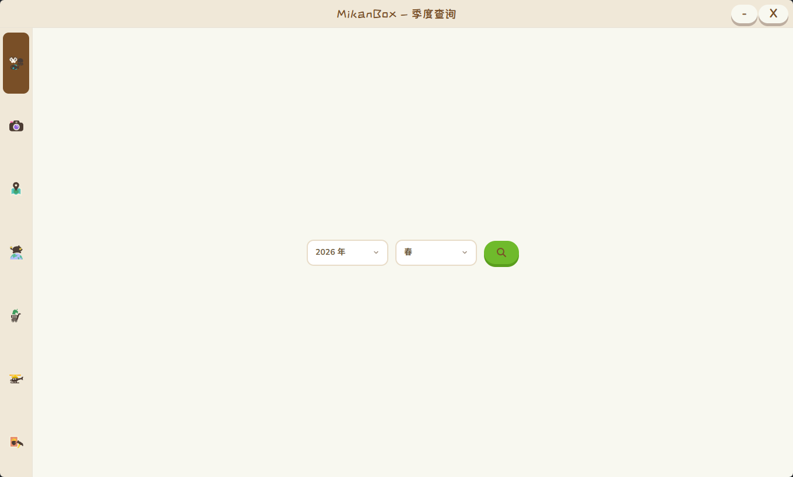<br>*季度查询初始状态* | 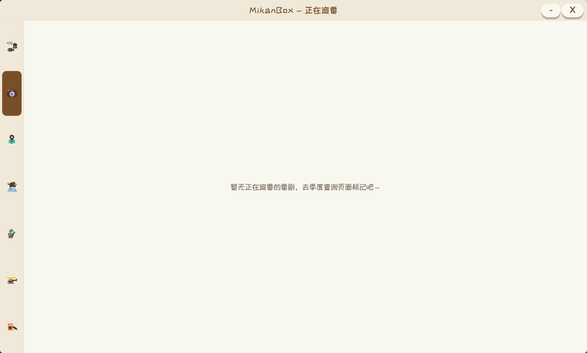<br>*正在追番初始状态* |
| 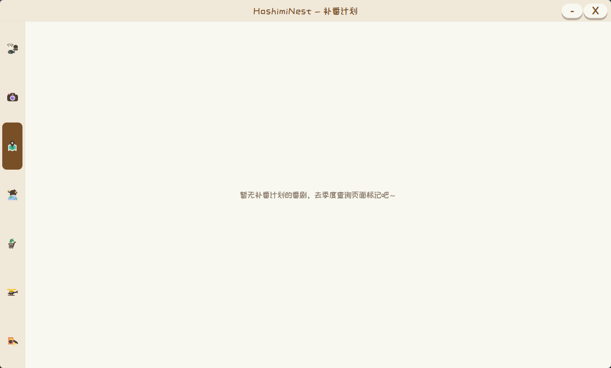<br>*补番计划初始状态* | <br>*已完番剧初始状态* |
| 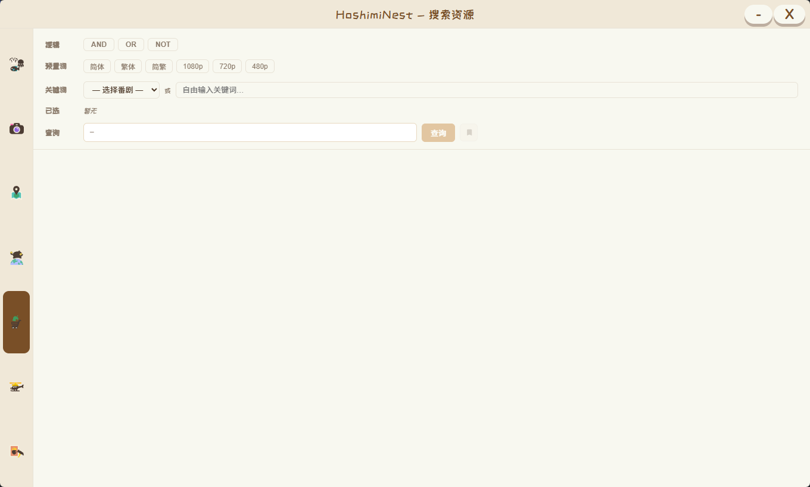<br>*搜索资源初始状态* | 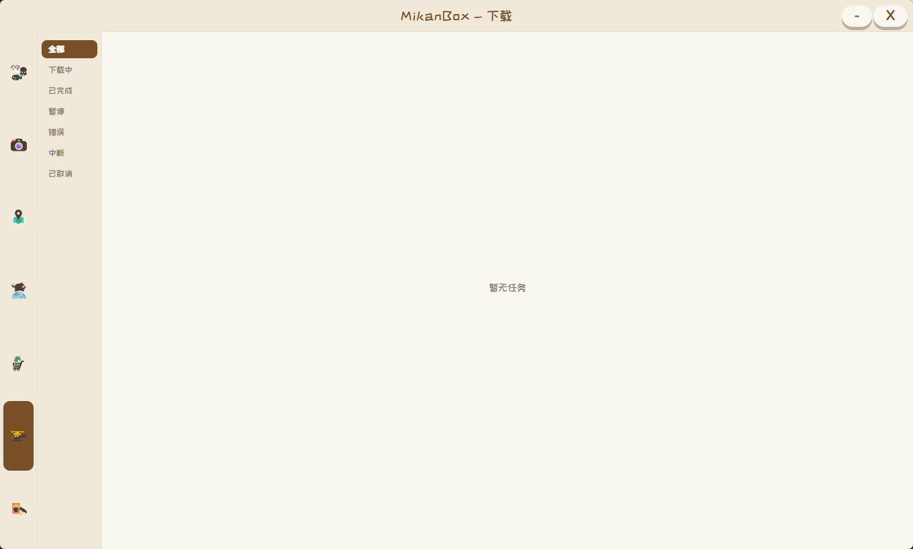<br>*下载管理初始状态* |
| 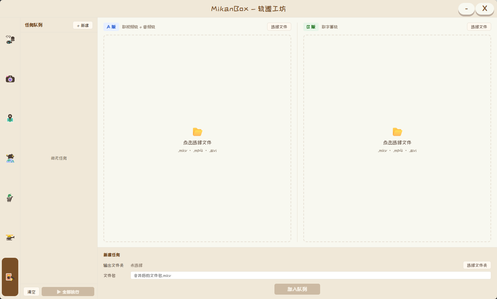<br>*轨道工坊初始状态* | |

---

## 2. 窗口基础行为

> **说明**：本应用为无边框窗口（`decorations: false`），窗口控件由前端自绘，顶栏为拖拽区域。

### 2.1 最小化与关闭

1. 点击顶栏左侧的 `-` 按钮（最小化）

> **预期结果**：
>
> - 按钮按下时有视觉动效（颜色/阴影变化）
> - 应用窗口最小化到任务栏
> - 任务栏图标可正常恢复窗口

2. 点击顶栏左侧的 `X` 按钮（关闭）

> **预期结果**：
>
> - 按钮按下时有视觉动效
> - 应用窗口关闭，进程退出
> - 任务栏图标消失

### 2.2 窗口拖拽

**可拖拽区域：**

1. 鼠标按住顶栏（标题栏）空白区域拖动 → 窗口跟随移动

**不可拖拽区域：**

1. 鼠标按住右侧主内容区域拖动 → 窗口不移动
2. 鼠标按住 `-` / `X` 按钮区域拖动 → 窗口不移动（仅触发按钮事件）

> **预期结果**：仅顶栏空白区可拖动窗口，其他区域均不可拖动

### 2.3 禁止窗口缩放

应用窗口固定 1360×820，不可调整大小。验证以下所有操作均无法改变窗口尺寸：

| 操作方式 | 说明 |
| --------- | ------ |
| 窗口边缘/角落拖拽 | 窗口无边框，无缩放手柄 |
| 双击顶栏 | 窗口不会最大化（非标准行为） |
| `Win + ↑` | Windows 最大化快捷键，窗口不应变化 |
| `Win + ↓` | 从最大化恢复，窗口不应变化 |
| `Win + ←/→` | 窗口贴靠屏幕左右半屏，窗口不应变化 |
| `Win + Shift + ↑` | 纵向拉伸到最大高度，窗口不应变化 |
| 拖拽窗口到屏幕顶部边缘 | Windows Aero Snap 最大化，窗口不应贴靠 |
| `Alt + Space` → 最大化 | 系统菜单最大化选项应置灰或无效 |
| `Alt + Space` → 大小 | 系统菜单大小选项应置灰或无效 |
| 任务栏右键 → 最大化 | 任务栏右键菜单最大化选项应置灰或无效 |
| `F11` | 全屏快捷键，窗口不应进入全屏 |
| 任务栏右键 → 移动 → 方向键 | 移动不应改变窗口大小 |

> **预期结果**：上述所有操作后，窗口始终维持在 1360×820，不可缩放或最大化

### 2.4 终端日志检查

在执行以上 2.1 ~ 2.3 所有操作过程中，观察 `yarn tauri:dev` 终端输出：

> **预期结果**：终端无任何错误日志（`ERROR` / `panic` / `unreachable` / stack trace），仅允许正常的 Vite HMR 和 Cargo 编译信息

---

## 3. 季度查询

> **说明**：查询范围为指定年份的春/夏/秋/冬某一季，通过页面中部下拉框切换年份和季度。当年最新一季仅显示当前已开始的季度（例如 6 月仅显示春季，不显示尚未到来的夏/秋/冬季）。

### 3.1 下拉框与搜索图标

**年份下拉框：**

1. 点击年份下拉框展开列表

> **预期结果**：
>
> - 列表可滚动，长度固定（超出可视范围时出现滚动条）
> - 最早可选年份为 1906

**季度下拉框：**

1. 点击季度下拉框展开列表

> **预期结果**：
>
> - 最多显示 4 项（春/夏/秋/冬），无滚动条
> - 当年仅显示已开始的季度

| 年份筛选 | 季度筛选 |
| ---------- | ---------- |
| 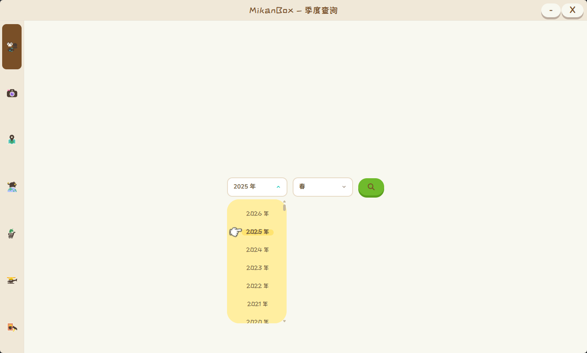 | 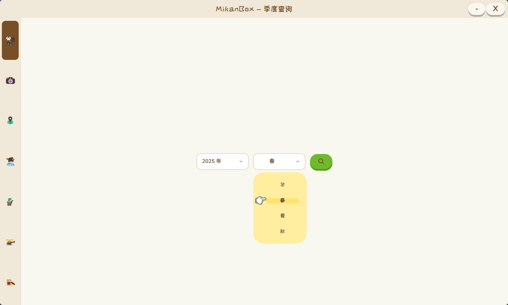 |

**搜索图标动效：**

1. 在下拉框旁找到搜索图标按钮
2. 用鼠标点击搜索图标

> **预期结果**：搜索图标按下时有视觉动效（颜色/阴影变化），与顶栏 `-` / `X` 按钮动效一致

### 3.2 基本查询与搜索动效

1. 启动应用后，默认进入「季度查询」页面，年份为最新年份，季度为当前所在季度
2. 选择年份和季度后，点击搜索图标触发查询

> **预期结果**：页面进入搜索中状态，显示为以下界面：


**搜索中界面动效：**

1. 观察页面中央的计时器

> **预期结果**：计时数字从 0 开始递增（单位：秒）

2. 观察页面右下角的加载图案

> **预期结果**：加载图案有晃动/摇摆的动画效果，持续播放直到搜索完成

### 3.3 取消搜索

1. 在搜索中状态，点击页面左上角的 ✕ 按钮

> **预期结果**：
>
> - 搜索请求被中断
> - 加载遮罩消失
> - 页面恢复为搜索前的可操作状态

### 3.4 搜索中切换页面

1. 在搜索进行中，点击左侧导航栏切换到其他页面（如「正在追番」）

> **预期结果**：
>
> - 页面正常切换，无卡顿或报错
> - 搜索计时在后台继续，不被中断

2. 再次点击「季度查询」切换回查询页面

> **预期结果**：
>
> - 搜索中状态完整保留，计时器、加载动画均未失效
> - 如搜索仍在进行中，界面保持搜索中状态；如已完成，显示结果列表

3. 搜索进行中可切换至任意页面，不影响搜索计时和动效

### 3.5 搜索结果页面概览

搜索完成后，页面分为三个区域：顶部标题栏、中部筛选栏、下部双栏布局。

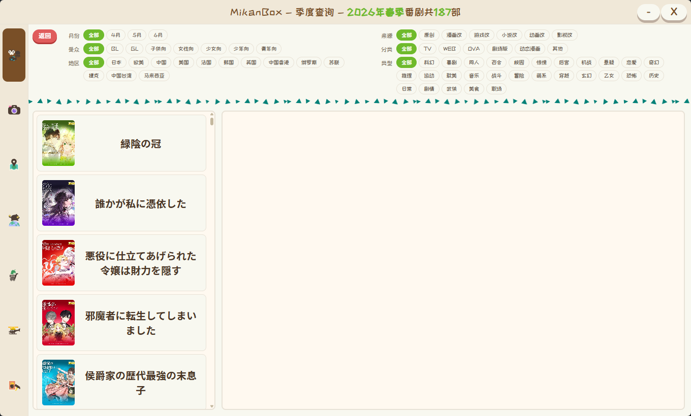

1. 顶部标题栏显示当前搜索的年份、季度及番剧总数

> **预期结果**：标题格式为 `HoshimiNest - 季度查询 - 20XXQX番剧共N部`

2. 页面下部为左右双栏布局：左侧为番剧摘要列表，右侧为番剧详情（初始为空白）

### 3.6 筛选栏


在搜索结果页面中部，提供以下筛选条件（点击任意筛选项后列表即时过滤）：

| 筛选项 | 说明 |
| ------- | ------ |
| **月份** | 按播出月份筛选（1~12 月） |
| **来源** | 按番剧来源筛选（如小说改编、漫画改编、原创等） |
| **受众** | 按目标受众筛选 |
| **分类** | 按平台分类筛选（如 TV、OVA、剧场版等） |
| **地区** | 按制作地区筛选（如日本、中国等） |
| **类型** | 按内容类型筛选（标签/题材） |

1. 点击任一筛选项的「全部」按钮 → 清除该筛选，显示全部结果
2. 点击单个筛选项 → 该项高亮，列表仅显示匹配结果
3. 同一筛选组内同时选择多个值（如地区同时选「日本」和「中国」）→ 结果为并集（满足任一即可）
4. 跨不同筛选组组合（如「地区=日本」+「分类=TV」）→ 结果取交集（同时满足）

> **预期结果**：每次切换筛选后，列表即时刷新，过滤结果正确

### 3.7 番剧摘要列表


左侧区域显示当前筛选条件下的番剧摘要列表：

1. 有中文译名的番剧 → 显示中文名
2. 无中文译名的番剧 → 显示原名
3. 有评分的番剧 → 显示评分；无评分 → 不显示评分字段
4. 点击任意摘要条目 → 右侧区域显示该番剧的详细信息

> **预期结果**：名字和评分显示符合上述规则，点击后右侧详情同步更新

### 3.8 番剧详情区域


点击左侧摘要条目后，右侧区域显示该番剧的完整详情：

1. **基本信息**：中文名（无中文名时仅显示原名）
2. **追番状态**：当前用户的收藏状态
3. **上映日期**：番剧首播日期
4. **番剧标签**：该番剧关联的标签列表
5. **章节列表**：以数字序号展示（如 1、2、3），已播出和未播出的均列出
6. **角色链接**：列出主要角色，点击后弹出角色详情卡片
7. **演职人员**：列出制作人员（声优、监督等），点击后弹出人物详情卡片
8. **追番状态按钮**：点击追番状态按钮后，该番剧会出现在左侧导航栏对应的页面中（如在「季度查询」页面标记为「正在追番」，则该番剧会同步显示在「正在追番」页面；标记为「已完番剧」，则显示在「已完番剧」页面。即番剧会显示在相应的界面中）

### 3.9 角色详情卡片

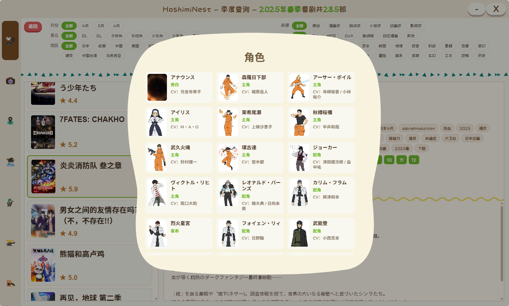

1. 在详情区域点击任一角色名称

> **预期结果**：
>
> - 弹出角色详情卡片，显示角色名、声优等信息
> - 卡片可关闭（点击 ✕ 或遮罩区域）

### 3.10 演职人员详情卡片

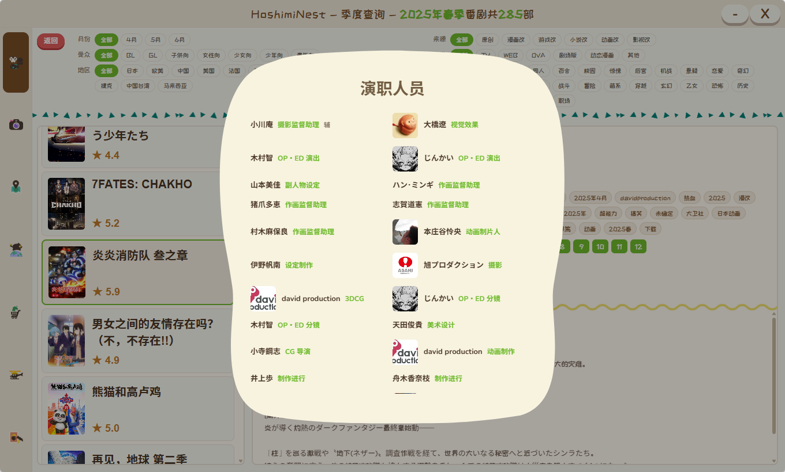

1. 在详情区域点击任一演职人员名称

> **预期结果**：
>
> - 弹出人物详情卡片，显示姓名、相关作品等信息
> - 卡片可关闭（点击 ✕ 或遮罩区域）

---

## 4. 正在追番

> **前置操作**：需要在「季度查询」页面先将番剧添加为「正在追番」状态（点击番剧详情区域的追番状态按钮，详见 [3.8 番剧详情区域](#38-番剧详情区域) 第 8 条）。

### 4.1 按曜日排序（默认）

首次进入「正在追番」页面，默认按番剧首次上映的星期排序，并标注曜日（如月曜日、火曜日等）。


> **预期结果**：
>
> - 每行最多显示 8 个番剧卡片
> - 每张卡片下部显示番剧名称、上映日期及评分
> - 番剧按曜日分组排列

### 4.2 按上映日期排序

1. 在页面中找到排序切换按钮
2. 切换为按上映日期排序


> **预期结果**：
>
> - 每行最多显示 8 个番剧卡片
> - 番剧按上映日期先后排列
> - 卡片显示内容与曜日排序一致（名称、日期、评分）

### 4.3 番剧详情

1. 点击任意番剧卡片


> **预期结果**：弹出详情弹窗，内容与 [3.8 番剧详情区域](#38-番剧详情区域) 完全一致，包含：
>
> - 基本信息（中文名/原名）
> - 追番状态
> - 上映日期
> - 番剧标签
> - 章节列表（数字序号）
> - 角色链接（可点击弹出角色详情卡片）
> - 演职人员列表（可点击弹出人物详情卡片）
> - 追番状态按钮（可修改收藏状态）

---

## 5. 补番计划

> **前置操作**：需要在「季度查询」页面先将番剧添加为「补番计划」状态，与「正在追番」添加方式相同，详见 [3.8 番剧详情区域](#38-番剧详情区域) 第 8 条。


### 5.1 界面布局与排序

补番计划与 [4. 正在追番](#4-正在追番) 的全部界面布局和交互逻辑完全一致（包含日期排序、番剧详情弹窗等，无曜日排序）：

1. 按上映日期排序
2. 每行最多显示 8 个番剧卡片，卡片下部显示番剧名称、上映日期及评分

### 5.2 番剧详情

1. 点击任意番剧卡片

> **预期结果**：弹出详情弹窗，内容与 [3.8 番剧详情区域](#38-番剧详情区域) 完全一致

---

## 6. 已完番剧

> **前置操作**：需要在「季度查询」页面先将番剧添加为「已完番剧」状态，详见 [3.8 番剧详情区域](#38-番剧详情区域) 第 8 条。


### 6.1 界面布局与排序

已完番剧与 [4. 正在追番](#4-正在追番) 的全部界面布局和交互逻辑完全一致（包含日期排序、番剧详情弹窗等，无曜日排序）：

1. 按上映日期排序
2. 每行最多显示 8 个番剧卡片，卡片下部显示番剧名称、上映日期及评分

### 6.2 番剧详情

1. 点击任意番剧卡片

> **预期结果**：弹出详情弹窗，内容与 [3.8 番剧详情区域](#38-番剧详情区域) 完全一致

---

## 7. 搜索资源

### 7.1 关键词搜索与预置词

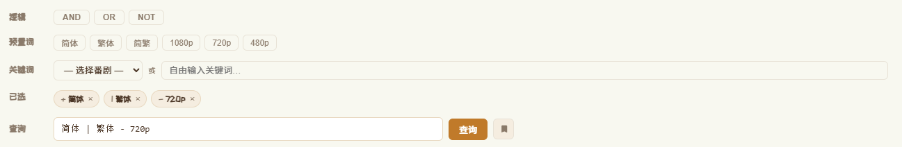

搜索资源页面提供三种互斥的搜索方式：**预置词**、**关键词-选择番剧**、**关键词-自由输入关键词**。三种方式只能同时使用一种。

**预置词：**

1. 点击预置词标签（如 `1080p`、`简体内嵌` 等）→ 标签添加到已选查询区域
2. 点击已选标签上的 ✕ → 该标签从查询条件中移除
3. 若已选中含关键词 A，则所有与 A 冲突的标签不可被添加

> **预期结果**：标签正确添加/移除，冲突标签自动置灰不可点击

**关键词-选择番剧：**

1. 选择「关键词-选择番剧」下拉框

> **预期结果**：下拉列表中预制了当前「正在追番」页面中的番剧内容

**关键词-自由输入关键词：**

1. 选择「关键词-自由输入关键词」输入框，手动输入番剧名称
2. 支持 AND 逻辑（空格分隔）、OR 逻辑（`|` 分隔）、NOT 逻辑（`-` 前缀）

> **预期结果**：三种逻辑组合的搜索结果正确过滤

### 7.2 书签收藏

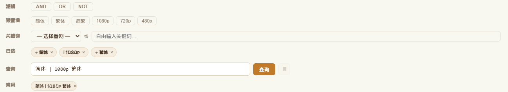

在查询栏旁边有书签按钮，可将当前查询条件一键收藏：

1. 设置好查询条件后，点击书签按钮 → 当前条件保存为书签
2. 后续点击书签 → 一键填充查询条件并执行搜索
3. 点击书签上的 ✕ → 移除该书签

> **预期结果**：书签保存/填充/删除均正常

### 7.3 搜索结果表格

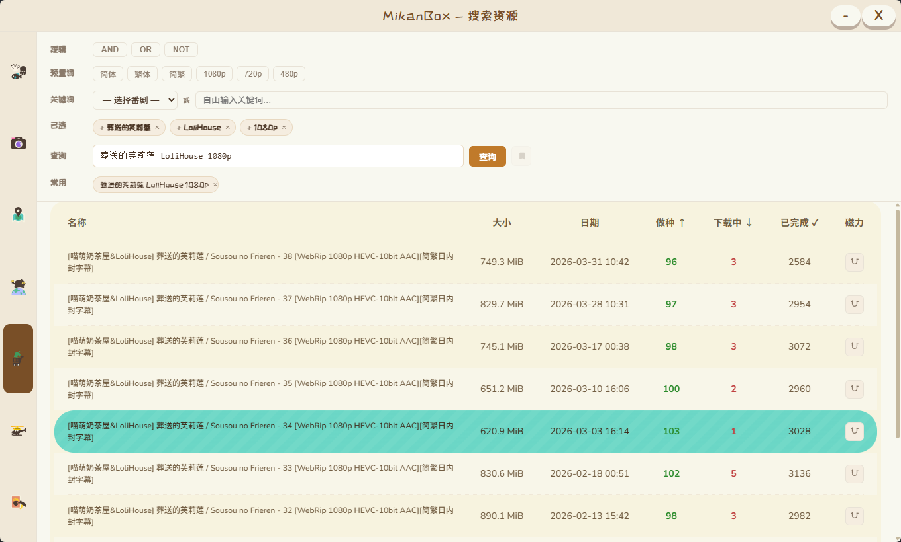

搜索结果以表格形式展示，包含以下字段：

| 列 | 内容 |
| --- | ------ |
| 名称 | 资源文件名 |
| 大小 | 文件大小 |
| 日期 | 资源发布时间 |
| 做种 ↑ | 做种数量 |
| 下载中 ↓ | 正在下载的数量 |
| 已完成 ✓ | 已完成的下载次数 |
| 磁力 | 磁力链接按钮 |

1. 鼠标悬停在某一行上

> **预期结果**：该行出现蓝绿色高亮背景

2. 点击某行的磁力链接按钮

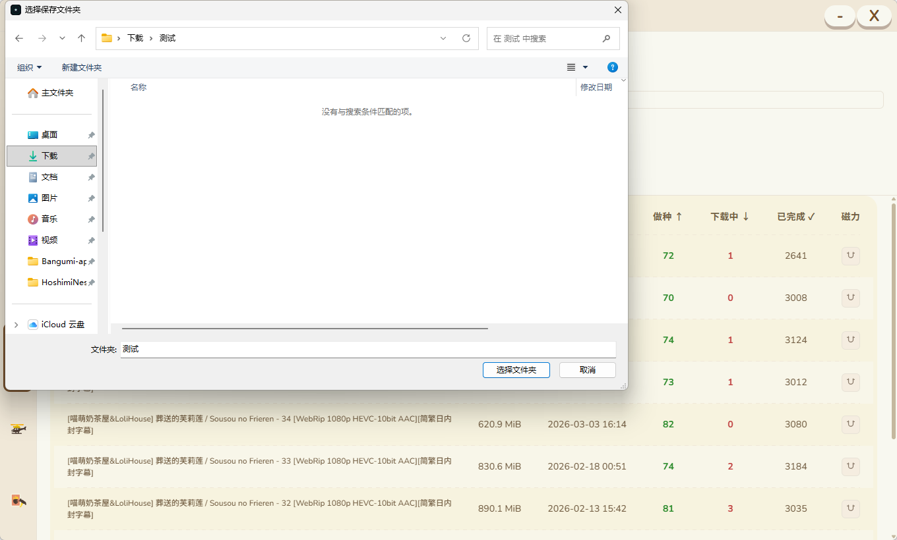

> **预期结果**：弹出文件夹选择对话框，选择目标文件夹后，下载任务自动添加到下载队列（详见 [8. 下载管理](#8-下载管理)）

---

## 8. 下载管理

> **说明**：磁力链接的添加方式已在 [7. 搜索资源](#7-搜索资源) 中说明。

### 8.1 下载状态截图

以下展示下载管理中各操作对应的界面状态：

| | |
| --- | --- |
| 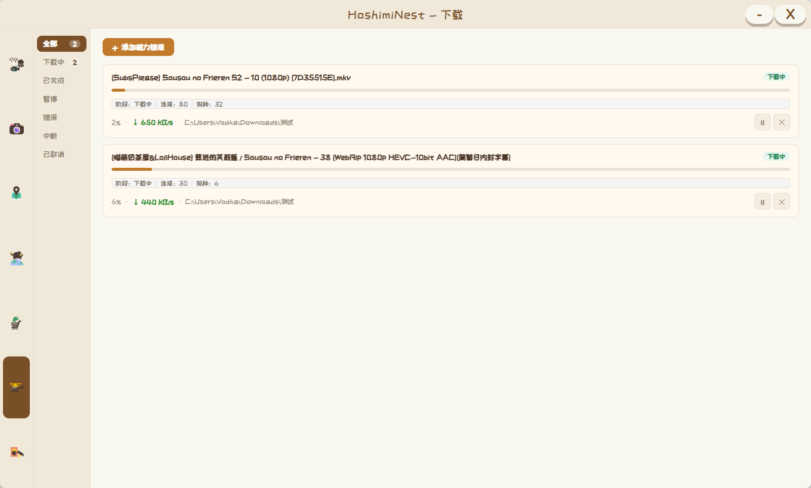<br>*两个正在下载* | <br>*暂停一个下载* |
| <br>*暂停两个下载* | 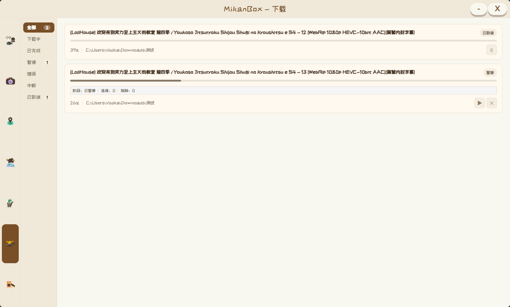<br>*取消一个下载* |
| 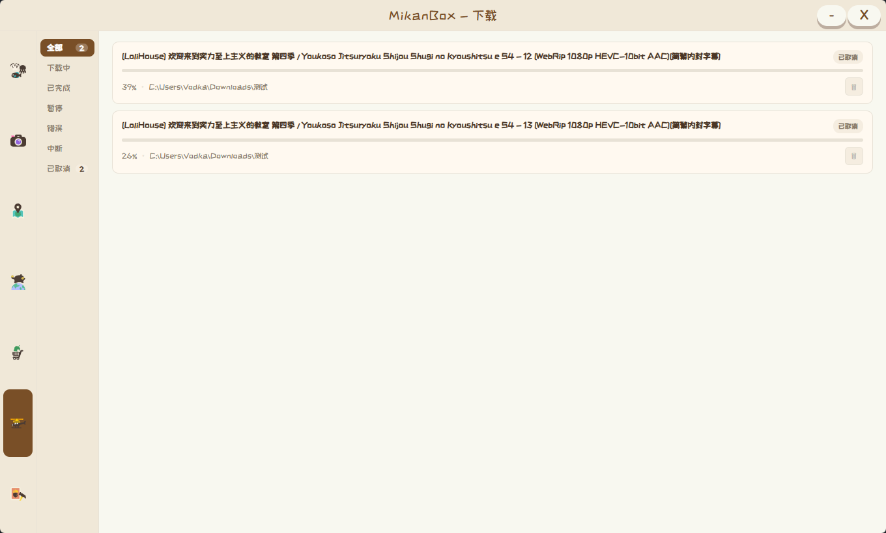<br>*取消两个下载* | 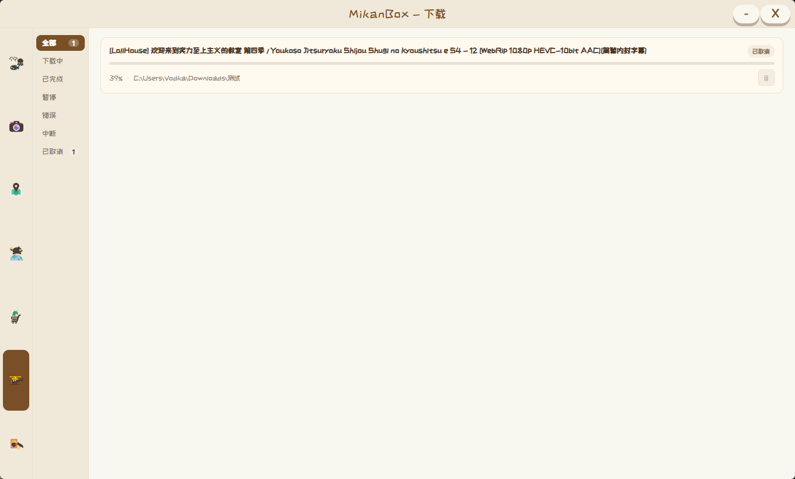<br>*删除一个记录* |

### 8.2 下载中断

1. 在下载进行中（参考 [8.1 下载状态截图](#81-下载状态截图)），点击顶栏 `X` 按钮关闭应用
2. 重新执行 `yarn tauri:dev` 启动应用
3. 进入「下载管理」页面

> **预期结果**：之前正在下载的任务显示为「中断」状态

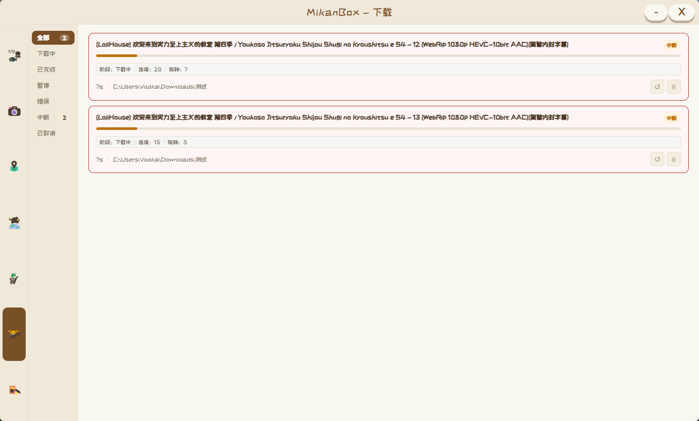

### 8.3 断点续传

1. 在下载管理页面找到状态为「中断」的任务
2. 点击该任务的「开始」/「继续」按钮

> **预期结果**：任务从中断处恢复下载（断点续传），而非重新开始

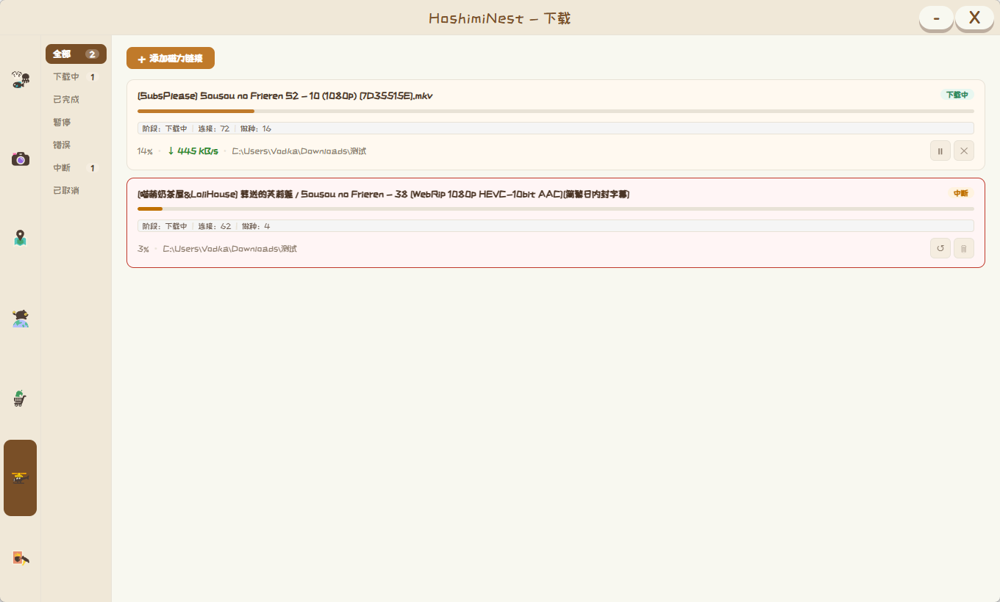

### 8.4 下载完成

1. 等待下载任务完成

> **预期结果**：任务显示为「完成」状态

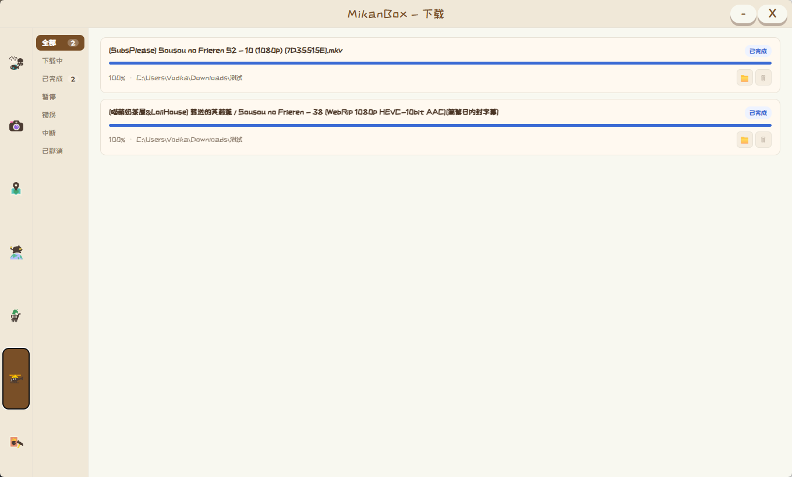

2. 点击已完成任务右侧的文件夹图标

> **预期结果**：打开系统文件管理器并定位到下载文件所在目录

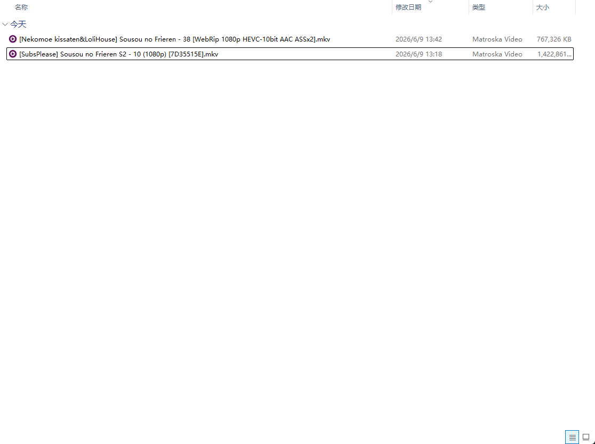

---

## 9. 轨道工坊

### 9.1 添加文件

以下界面中框起来的区域均可点击添加文件，注意不支持拖拽添加。

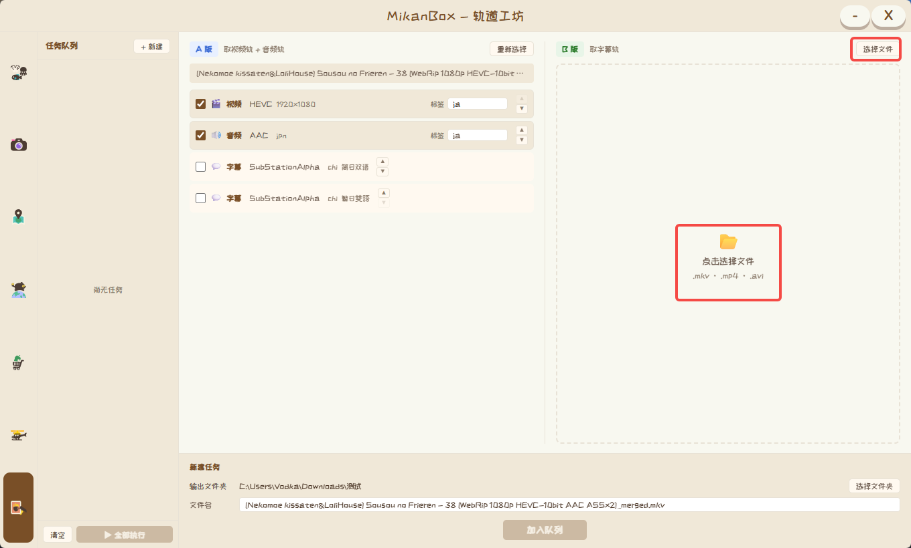

### 9.2 默认布局与参数

打开轨道工坊后，默认布局为：

| 位置 | 用途 | 默认值 |
| --- | --- | --- |
| 左侧 | 视频/音频文件 | — |
| 右侧 | 字幕文件 | — |
| 音轨语言标签 | — | `ja` |
| 字幕语言标签 | — | `zh-Hans` |
| 输出文件夹 | — | 左侧文件所在文件夹 |
| 输出文件名 | — | 自动生成 |

所有参数均可手动更改。输出文件夹和文件名均可通过界面控件修改。

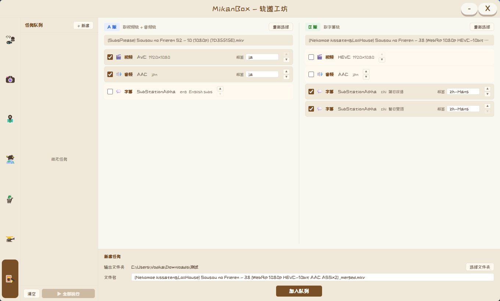

### 9.3 加入队列

设置完成后点击「加入队列」按钮，任务将被添加到处理队列中。

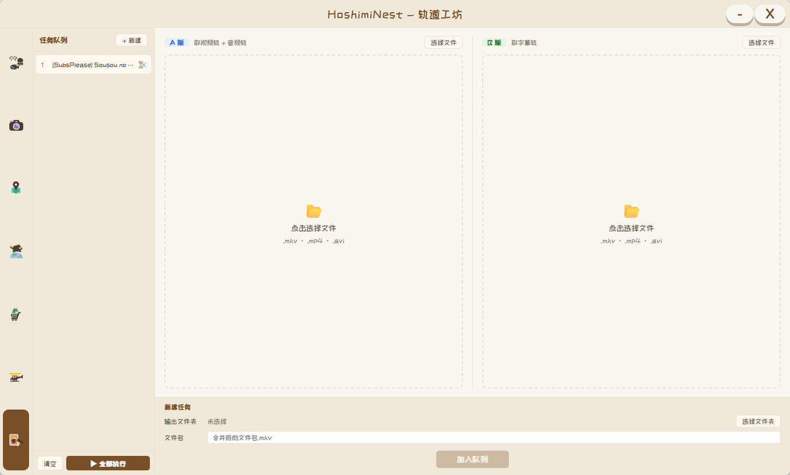

### 9.4 关闭应用后队列清空

轨道工坊的队列不进行持久化存储，关闭应用后所有任务数据将丢失：

- **队列中的任务（pending）**：关闭后丢失，重开软件后任务队列为空
- **正在执行的任务（running）**：关闭后子进程随应用退出终止，任务不会恢复

> **预期结果**：重新进入「轨道工坊」页面后，「任务队列」区域显示为「尚无任务」。

### 9.5 合并完成

任务执行完成后，队列中显示为完成状态。

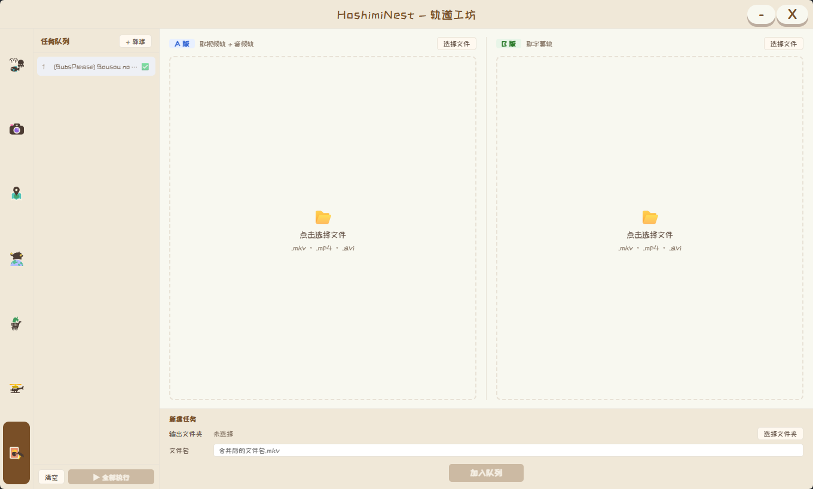

---

## 10. 通用功能

### 10.1 追番数据持久化

> **说明**：正在追番、补番计划、已完番剧三个页面的数据通过 `localStorage` 持久化存储，关闭应用后数据不会丢失。

1. 在「季度查询」页面中，将若干个番剧分别添加为「正在追番」「补番计划」「已完番剧」
2. 切换到对应页面确认番剧已正确显示
3. 点击顶栏 `X` 按钮关闭应用
4. 重新执行 `yarn tauri:dev` 启动应用
5. 依次点击「正在追番」「补番计划」「已完番剧」

> **预期结果**：三个页面中先前添加的番剧数据完整保留，无丢失
